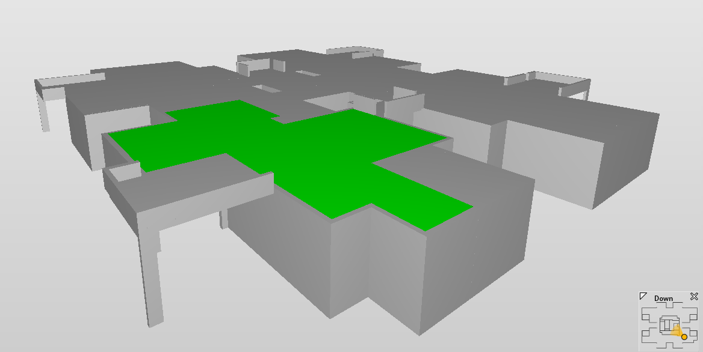

# Challenge 4:  Semantic Enrichment
**Champions**: Tanya Bloch, Rafael Sacks, Pieter Pauwels

**Number of people per team**: 3-4

**Anticipated workload**: about 20-25 hours per person, which includes time for preparation of the presentation.

## Challenge description: 
Semantic enrichment tasks can be arranged into four main groups, one of which is the **‘association task’** (Bloch and Sacks, 2020). An explicit representation of relationships (associations) between building elements in a BIM model would enable application of intelligent processes for various purposes. For example, an **explicit relationship** between an element and its structural support (e.g. a structural column and a beam that it supports) can **facilitate an automatic check of the structural design**. These associations can also be useful for quality check of the analytical model. Such relationships can be **inferred by examining the spatial relationship between objects**, either by using their bounding boxes or their exact **geometry**, in combination with **reasoning** about the objects’ functionality (often defined by object type). The **semantic enrichment** process requires not only to identify the relationship, but to also represent it explicitly within the building model. This can be done directly in an **IFC file** or in an **RDF-based representation** of the building.

Within the coding challenge you will work on the following **tasks**:
* **Identify the types of relationships** (‘supports/supported_by’) between each pair of structural elements. Begin with a rule-based approach to identify the relationship type between every pair of elements (an analysis of geometry and functionality of the objects). Use the results and the attached set of models to generate a labelled data set that can be used to classify the relationships with supervised ML. Alternatively, generate a graph based labelled data set and use a Graph Neural Network (GNN) to infer the relationships.
* Supplement a structural model with **‘supports/supported_by’ relationships between each pair of structural elements**. Consider supplementing the information directly to the IFC, or following the CBIM ontology (Ouyang et al., 2022). 

## Challenger Research Questions:
* What are the key challenges in each of the inference approaches (rule based, ML based, GNN)?
* What sets of rules can be used to infer the relationship type in a rule-based approach? What are the attributes that can be useful for inferencing with ML or GNNs?
* Suggest a workflow where the inferred relationships can be useful.

## Data Sets available: 
* Set of 50 structural models in an IFC format is available in the [resources folder](/resources/)
* CBIM ontology: [https://raw.githubusercontent.com/terry-oy/CBIM-Ontology/main/CBIM-Ontology.owl](https://raw.githubusercontent.com/terry-oy/CBIM-Ontology/main/CBIM-Ontology.owl)

## Challenge Instructions
Bring your laptop.

## Tools
* Excel
* IFCtoLBD: https://github.com/pipauwel/IFCtoLBD and https://github.com/jyrkioraskari/IFCtoLBD
* IFCtoRDF: https://github.com/pipauwel/IFCtoRDF

## References
1. Bloch, T., Sacks, R., 2020. Clustering Information Types for Semantic Enrichment of Building Information Models to Support Automated Code Compliance Checking. Journal of Computing in Civil Engineering 34, 04020040.
2. Ouyang, B., Wang, Z., and Sacks, R. (2022). "Semantic Enrichment Across Federated BIM Semantic Graphs in a Common Data Environment", European Conference on Process and Product Modeling, Trondheim, Norway, July 2022. Under review.
